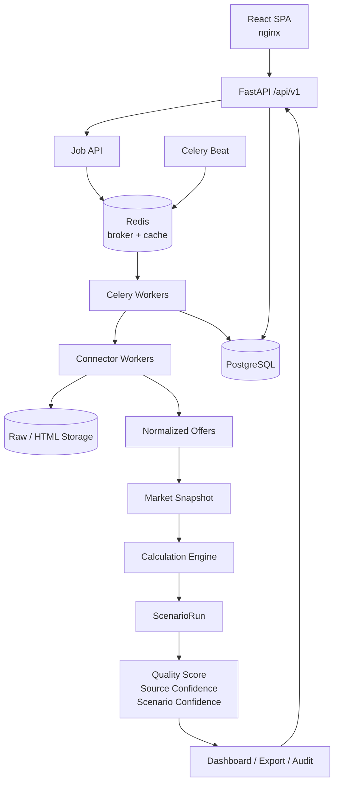
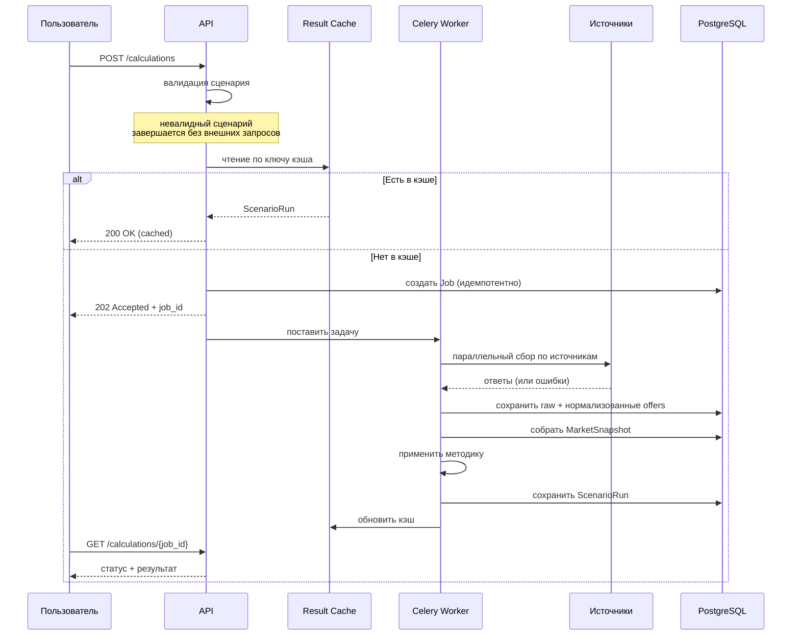
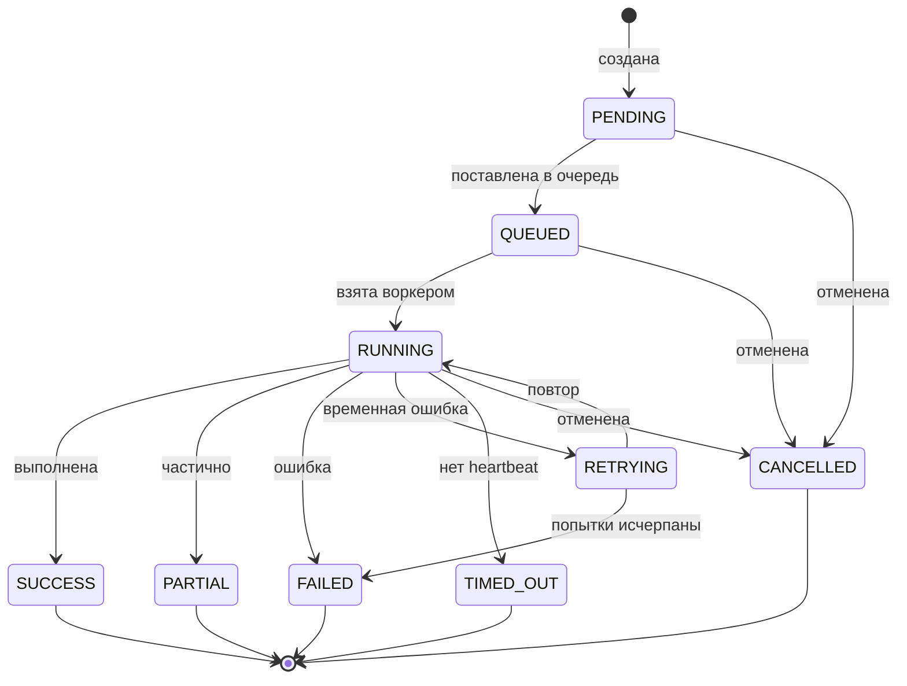
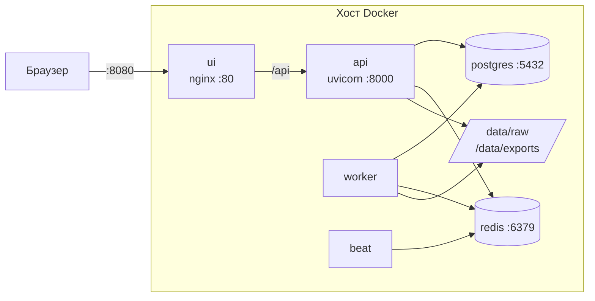

# Архитектура

## Логическая схема

## Слои кода

| Слой | Каталог | Ответственность | Зависит от |
|---|---|---|---|
| Ядро | `tco/core/` | конфигурация, логирование, ошибки, перечисления, RBAC | — |
| Данные | `tco/db/` | ORM-модели, сессии, кросс-диалектные типы | ядро |
| Контракты | `tco/schemas/` | Pydantic-схемы, правила профиля | ядро |
| Хранилища | `tco/storage/`, `tco/cache/` | raw-хранилище, кэш результатов | ядро, данные |
| Коннекторы | `tco/connectors/` | обращение к источникам, единый контракт | ядро |
| Нормализация | `tco/normalization/` | приведение к общей модели, классификация | ядро, данные |
| Движок | `tco/engine/` | отбор, агрегация, качество, уверенность | данные, контракты |
| Сервисы | `tco/services/` | сценарии использования | все нижние |
| Задачи | `tco/tasks/` | Celery-обвязка | сервисы |
| API | `tco/api/` | HTTP, RBAC, error envelope | сервисы, задачи |
| Интерфейс | `frontend/` | SPA | только API |

Зависимости направлены вниз. Движок не знает про HTTP и Celery, коннекторы не
знают про движок, интерфейс общается только через `/api/v1`.

## Поток расчета по запросу

Ошибка одного источника не прерывает сбор остальных: снимок получает статус
`PARTIAL`, расчет выполняется на доступных данных, а причина фиксируется в
`SnapshotSourceResult` и в объяснимости.

## Жизненный цикл задачи

Идемпотентность: ключ строится из отпечатка сценария, временного окна, версии
профиля и типа запуска. Повторный запуск в том же окне возвращает существующую
задачу вместо создания дубля.

Зависшая задача обнаруживается по отсутствию `heartbeat_at` дольше порога и
переводится в `TIMED_OUT` отдельной задачей Beat каждые 10 минут.

## Развертывание

Фронтенд и API находятся на одном origin: nginx проксирует `/api` на backend.
CORS не задействован, токен не пересекает границу источников.

Очереди Celery разделены по характеру нагрузки:

| Очередь | Задачи | Конкурирует за |
|---|---|---|
| `collect` | обращение к источникам | сеть |
| `compute` | расчет и мониторинг | CPU |
| `ondemand` | пользовательские запросы | приоритет отклика |
| `maintenance` | retention, метрики, экспорт | фон |

Разделение не даёт обслуживанию вытеснять пользовательские расчеты.

## Масштабирование

Текущая конфигурация рассчитана на одну VM и целевые 100+ сценариев мониторинга
четыре раза в сутки.

При росте нагрузки: увеличить число воркеров `collect`, вынести raw-хранилище
в S3/MinIO (`S3_ENDPOINT_URL`), добавить реплику PostgreSQL для чтения
аналитики. Ограничитель частоты API при горизонтальном масштабировании нужно
перенести в Redis — сейчас счетчик локален процессу (см.
[ограничения](LIMITATIONS.md)).
